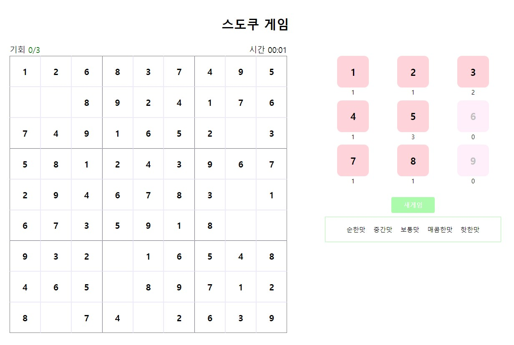

<h2>스도쿠 <a href='https://pukkok.github.io/sudoku'>[게임하러가기]</a></h2> 

 
<h2> 날짜별 업데이트 내용 </h2>
<BlockQuote>6/24</BlockQuote>
 
1. 스도쿠 게임 알고리즘 구현하기

<BlockQuote>6/25</BlockQuote>

1. 난이도 구현
2. 반응형 구현 계획

<BlockQuote>6/25</BlockQuote>

1. 모바일 버전으로 구현 시 input으로 만든경우 아래 키보드가 나옴. 화면에 버튼을 만들어 사용하도록 구현.
2. 모바일 세로 버전시 아래로 버튼 이동 되도록 grid 변경

<BlockQuote>8/16</BlockQuote>

1. 타이머 구현 완료
2. 승리, 패배시 타이머 종료 구현
3. 난이도 선택시 타이머만 초기화 되는점 수정
4. 구현 마무리
